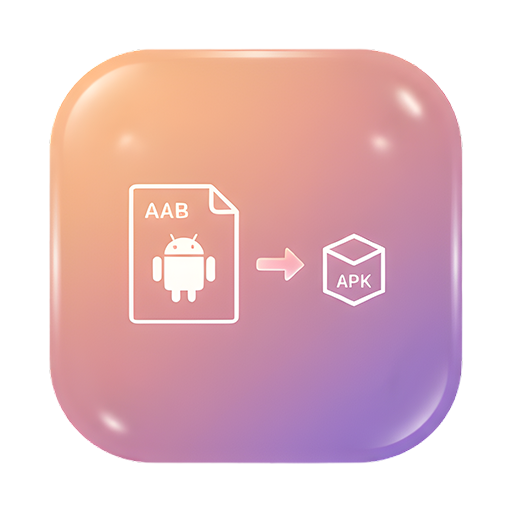

<p align="center">
  
</p>

<h1 align="center">AABTool</h1>

<p align="center">
  <strong>A native macOS app to convert Android App Bundles (.aab) to APK files</strong>
</p>

<p align="center">
  
  
  
</p>

---

## Overview

**AABTool** is a lightweight macOS GUI application built with SwiftUI that wraps Google's [`bundletool`](https://github.com/google/bundletool) to convert `.aab` (Android App Bundle) files into installable `.apk` files — with zero command-line knowledge required.

## Features

- 📦 **AAB → APK Conversion** — Universal or Split APK modes
- 🔑 **Keystore Management** — Select `.jks`/`.keystore` files with secure password input
- 📋 **Recent Keystores** — Auto-saves keystore profiles (path, alias, passwords) for quick reuse
- 🔍 **Command Preview** — See the exact `bundletool` command before running
- 📁 **Smart Output** — Auto-defaults output directory to the AAB file's location
- 📄 **Auto-Extract** — Automatically unzips `.apks` to individual APK files with size info
- ☕ **Embedded JRE Support** — Optionally bundle a JRE for self-contained distribution
- 🪟 **Single Instance** — Prevents multiple app windows/processes

## Screenshots

<p align="center">
  
  
</p>

## Requirements

- **macOS 14.0+** (Sonoma or later)
- **Java JDK/JRE** installed (e.g., [OpenJDK](https://adoptium.net/))
- **bundletool.jar** (included or [download here](https://github.com/google/bundletool/releases))

## Installation

### Option 1: Build from Source

```bash
cd AABTool
swift build -c release
```

### Option 2: Build as .app Bundle

```bash
cd AABTool
chmod +x build_app.sh
./build_app.sh
```

The app bundle will be created at `dist/AABTool.app`. You can drag it to your **Applications** folder.

### Option 3: Open in Xcode

1. Open `AABTool/Package.swift` in Xcode
2. Select the `AABTool` scheme → **My Mac**
3. Run (**⌘R**)

## Setup

### 1. bundletool.jar

The repository includes `bundletool.jar` in the Resources directory. To update it:

1. Download the latest version from [bundletool releases](https://github.com/google/bundletool/releases)
2. Rename to `bundletool.jar`
3. Replace `AABTool/Sources/AABTool/Resources/bundletool.jar`

### 2. Java Runtime

The app needs Java to run bundletool. It resolves Java in this order:

| Priority | Source | Description |
|----------|--------|-------------|
| 1 | Embedded JRE | `Resources/jre/bin/java` inside the bundle |
| 2 | User Preference | Previously selected path (saved in preferences) |
| 3 | System Default | `/usr/bin/java` |

If the default doesn't work, click **Browse** next to "Java Path" and select your `java` executable manually.

<details>
<summary><strong>Optional: Embed a JRE</strong></summary>

Create a minimal JRE using `jlink`:

```bash
jlink \
  --module-path $JAVA_HOME/jmods \
  --add-modules java.base,java.logging,java.desktop,java.xml,java.sql,java.management \
  --strip-debug \
  --compress=2 \
  --no-header-files \
  --no-man-pages \
  --output ./jre
```

Copy the `jre` folder into `AABTool/Sources/AABTool/Resources/`.

</details>

## Usage

1. **Select AAB file** — Click Browse to pick your `.aab` file
2. **Select Keystore** — Pick your `.jks` or `.keystore` file (or choose from Recent)
3. **Enter credentials** — Keystore password, key alias, and key password
4. **Output directory** — Auto-filled to the AAB's folder, or change with Browse
5. **Choose mode** — Universal APK or Split APKs
6. **Convert** — Click the button and watch the output log

After conversion, the app automatically extracts the `.apks` archive and lists all generated APK files with their sizes.

## Project Structure

```
AABTool/
├── Package.swift              # Swift Package manifest
├── Info.plist                 # App bundle metadata
├── AppIcon.icns               # App icon (macOS format)
├── build_app.sh               # Script to build .app bundle
└── Sources/AABTool/
    ├── AABToolApp.swift        # App entry point & window config
    ├── ContentView.swift       # Main UI layout
    ├── MainViewModel.swift     # Business logic & state management
    ├── BundletoolRunner.swift  # bundletool execution & APK extraction
    ├── HistoryManager.swift    # Keystore profile persistence
    └── Resources/
        ├── bundletool.jar      # Google bundletool
        └── AppIcon.png         # App icon source
```

## Architecture

```
┌─────────────────────────────────────────────┐
│                ContentView                  │
│  ┌──────────────┐  ┌─────────────────────┐  │
│  │  Left Panel   │  │    Right Panel      │  │
│  │  - AAB File   │  │  - Command Preview  │  │
│  │  - Keystore   │  │  - Output Log       │  │
│  │  - Passwords  │  │  - Mode Picker      │  │
│  │  - Output Dir │  │  - Convert Button   │  │
│  │  - Java Path  │  │                     │  │
│  └──────┬───────┘  └──────────┬──────────┘  │
│         │                     │              │
│         └──────────┬──────────┘              │
│                    ▼                         │
│            MainViewModel                     │
│         ┌──────────┼──────────┐              │
│         ▼          ▼          ▼              │
│  BundletoolRunner  │   HistoryManager        │
│  (Process exec)    │   (UserDefaults +       │
│                    │    Security Bookmarks)   │
└────────────────────┴─────────────────────────┘
```

## License

MIT License — see [LICENSE](LICENSE) for details.

## Credits

- [bundletool](https://github.com/google/bundletool) by Google
- Built with ❤️ using SwiftUI
